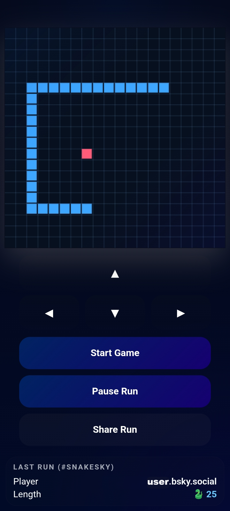

# SnakeSky

SnakeSky is a small experimental twist on the classic Snake:  
the world state is shared by players through the latest **#snakesky** post on Bluesky.

The game itself is a simple HTML/JS client.  
The shared length comes from an external JSON updated several times per day.

- The latest #snakesky post sets the starting length  
- Survive, pause, and share your run  
- If you die, the shared state resets to LENGTH=3  
- If you survive, the next player continues from your length

## Preview

## Play on itch.io

https://bunesky.itch.io/snakesky
